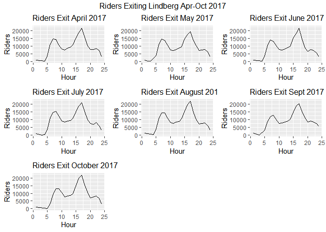
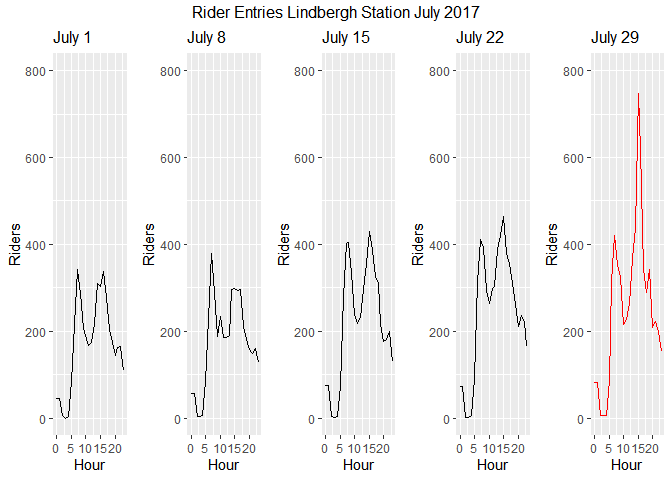
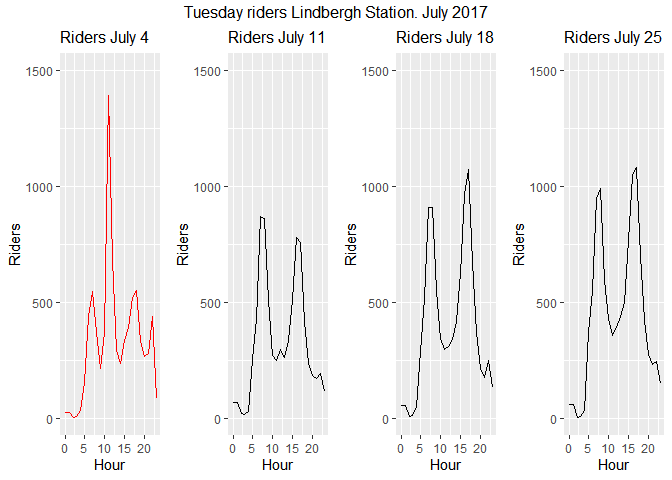

We look for unusual, unforecasted demand patterns for riders in major
city’s  
subway system. Based on Visual interpretation of noncyclical spikes. We
do  
background research to explain special events.

Look at turnstile exit averages for April-October, 2017

Monthly Demand Plots  

We look at weekends during the month of July. Atlanta United FBol Home
games:  
April 30, May 20, 28. June 17, 24. July 4, 29.

Plots for Month of July, 2017

Finally we look for unusual demand for July 4, 2017 - A Tuesday.  
Fireworks, and a UFC match.

Plot the July 4th festivities vs. other Tuesdays:

Note that the `echo = FALSE` parameter was added to the code chunk to
prevent printing of the R code that generated the plot.
