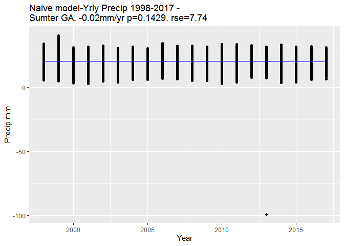
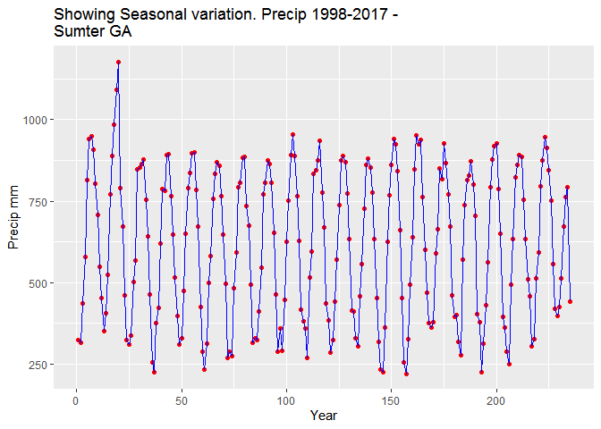
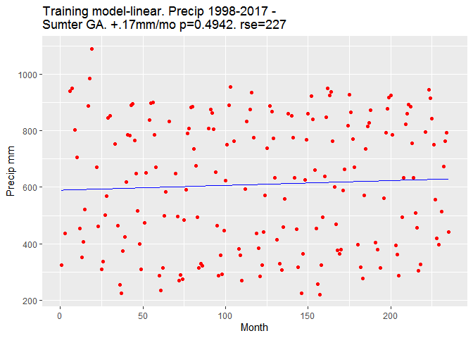
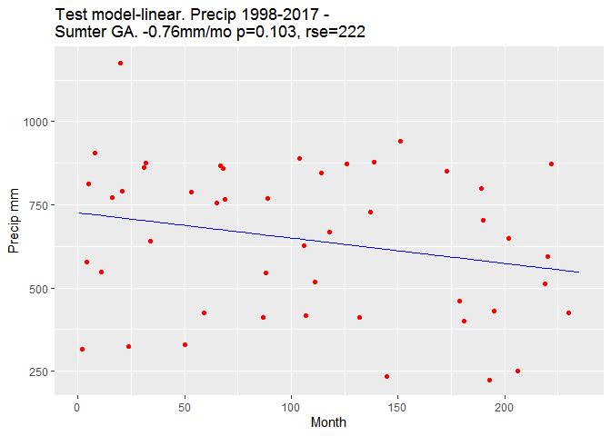
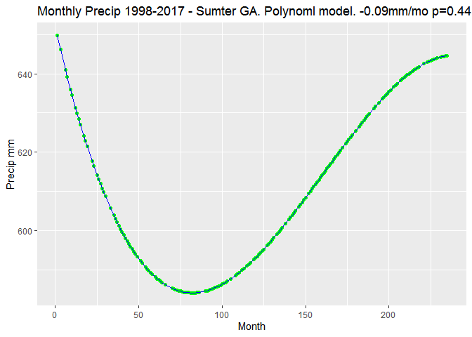
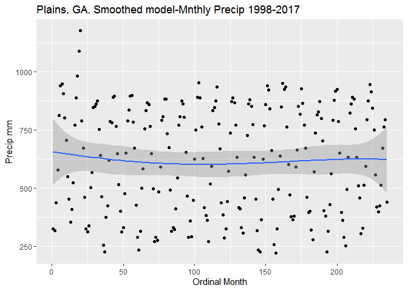
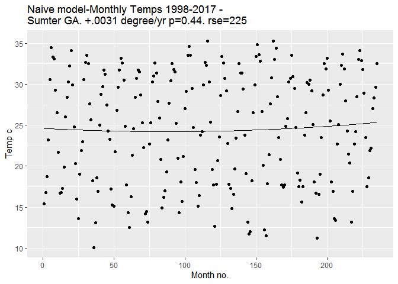
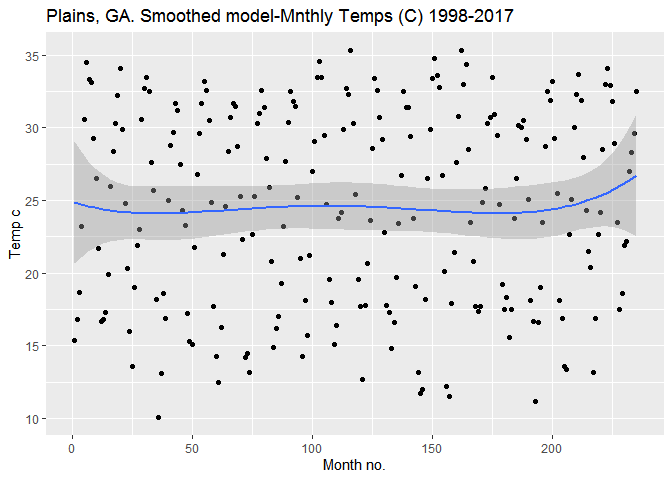

Sumter 10-yr Climate
================
Bob Erdman
September 21, 2020

Sumter co, GA 10 years precipitation We investigate rainfall and
temperature over 10 yrs to see if precipitation or temps affect crop
yields. \#\# rainfall (mm) vs. month and year

**Part 1** We begin with a simple linear model There are problems here:
the model’s predictive power is weak. p-value of 0.6 stderror = 227.

    ## 
    ## Call:
    ## lm(formula = Precip ~ Year, data = Peanutdata2)
    ## 
    ## Residuals:
    ##      Min       1Q   Median       3Q      Max 
    ## -119.190   -6.547    0.623    6.934   20.006 
    ## 
    ## Coefficients:
    ##             Estimate Std. Error t value Pr(>|t|)  
    ## (Intercept) 68.08812   32.59745   2.089   0.0368 *
    ## Year        -0.02379    0.01624  -1.465   0.1429  
    ## ---
    ## Signif. codes:  0 '***' 0.001 '**' 0.01 '*' 0.05 '.' 0.1 ' ' 1
    ## 
    ## Residual standard error: 7.744 on 7135 degrees of freedom
    ## Multiple R-squared:  0.0003008,  Adjusted R-squared:  0.0001607 
    ## F-statistic: 2.147 on 1 and 7135 DF,  p-value: 0.1429

<!-- -->

**Part 2** Daily precipition data will be aggregated by month. Am having
trouble stripping out month and year from the data field, could we try
an ordinal (numeric) month to easily plot a nonlinear trend +
seasonality?

    ## `summarise()` ungrouping output (override with `.groups` argument)

**Part 3** We’ll use machine learning Let’s use a training model, with
an 80/20 split to better predict precip.
<!-- -->

There is clearly seasonality, with peak rainfall in July-Aug each year.
here we want to regress precipition vs. month-yr ordinal number. (ie.
1st month, 10th month, etc.)

**Part 4** We know that a naive linear model is probably capturing a
long-term trend but not seasonal variation: We will try a machine
learning model, with testing split of 80/20. we group by year/month
first then use machine learning to train the model:

    ## 
    ## Call:
    ## lm(formula = Precip ~ YrMo, data = training_set)
    ## 
    ## Residuals:
    ##    Min     1Q Median     3Q    Max 
    ## -394.8 -221.3   14.1  204.9  497.3 
    ## 
    ## Coefficients:
    ##             Estimate Std. Error t value Pr(>|t|)    
    ## (Intercept) 589.6718    34.3660  17.159   <2e-16 ***
    ## YrMo          0.1704     0.2488   0.685    0.494    
    ## ---
    ## Signif. codes:  0 '***' 0.001 '**' 0.01 '*' 0.05 '.' 0.1 ' ' 1
    ## 
    ## Residual standard error: 227.6 on 186 degrees of freedom
    ## Multiple R-squared:  0.002516,   Adjusted R-squared:  -0.002847 
    ## F-statistic: 0.4692 on 1 and 186 DF,  p-value: 0.4942

<!-- -->

    ## 
    ## Call:
    ## lm(formula = Precip ~ YrMo, data = test_set)
    ## 
    ## Residuals:
    ##     Min      1Q  Median      3Q     Max 
    ## -407.54 -158.13   57.52  179.16  465.77 
    ## 
    ## Coefficients:
    ##             Estimate Std. Error t value Pr(>|t|)    
    ## (Intercept) 726.3630    58.4620  12.425 3.81e-16 ***
    ## YrMo         -0.7615     0.4577  -1.664    0.103    
    ## ---
    ## Signif. codes:  0 '***' 0.001 '**' 0.01 '*' 0.05 '.' 0.1 ' ' 1
    ## 
    ## Residual standard error: 222.6 on 45 degrees of freedom
    ## Multiple R-squared:  0.05795,    Adjusted R-squared:  0.03701 
    ## F-statistic: 2.768 on 1 and 45 DF,  p-value: 0.1031

<!-- -->

**Part 5** The data shows seasonal variation, and doesn’t look linear.
Could polynomial regression help? We use Adjusted R value, the Akaike
Information Criterion, and p to assess the value of 1st, 2nd, and 3rd
order coefficients:

``` r
library(caTools)
library(tidyverse) 

set.seed(123)
split = sample.split(Peanutdata2$Precip, SplitRatio = 0.8)
training_set = subset(Peanutdata2, split == TRUE)
test_set = subset(Peanutdata2, split == FALSE)
poly_Precip <- lm(formula = Precip ~ 1 + YrMo, data = training_set)
poly_Precip1 <- lm(formula = Precip ~ 1 + YrMo + I(YrMo^2), data = training_set)
poly_Precip2 <- lm(formula = Precip ~ 1 + YrMo + I(YrMo^2) + I(YrMo^3), data = training_set)
poly_Precip3 <- lm(formula = Precip ~ 1 + YrMo + I(YrMo^2) + I(YrMo^3) + I(YrMo^4), data = training_set)

summary(poly_Precip)
```

    ## 
    ## Call:
    ## lm(formula = Precip ~ 1 + YrMo, data = training_set)
    ## 
    ## Residuals:
    ##    Min     1Q Median     3Q    Max 
    ## -394.8 -221.3   14.1  204.9  497.3 
    ## 
    ## Coefficients:
    ##             Estimate Std. Error t value Pr(>|t|)    
    ## (Intercept) 589.6718    34.3660  17.159   <2e-16 ***
    ## YrMo          0.1704     0.2488   0.685    0.494    
    ## ---
    ## Signif. codes:  0 '***' 0.001 '**' 0.01 '*' 0.05 '.' 0.1 ' ' 1
    ## 
    ## Residual standard error: 227.6 on 186 degrees of freedom
    ## Multiple R-squared:  0.002516,   Adjusted R-squared:  -0.002847 
    ## F-statistic: 0.4692 on 1 and 186 DF,  p-value: 0.4942

``` r
AIC(poly_Precip)
```

    ## [1] 2578.27

``` r
summary(poly_Precip1)
```

    ## 
    ## Call:
    ## lm(formula = Precip ~ 1 + YrMo + I(YrMo^2), data = training_set)
    ## 
    ## Residuals:
    ##     Min      1Q  Median      3Q     Max 
    ## -383.00 -221.01   13.66  209.01  475.23 
    ## 
    ## Coefficients:
    ##               Estimate Std. Error t value Pr(>|t|)    
    ## (Intercept) 627.837795  53.536252  11.727   <2e-16 ***
    ## YrMo         -0.749999   1.020534  -0.735    0.463    
    ## I(YrMo^2)     0.003834   0.004123   0.930    0.354    
    ## ---
    ## Signif. codes:  0 '***' 0.001 '**' 0.01 '*' 0.05 '.' 0.1 ' ' 1
    ## 
    ## Residual standard error: 227.7 on 185 degrees of freedom
    ## Multiple R-squared:  0.007158,   Adjusted R-squared:  -0.003576 
    ## F-statistic: 0.6669 on 2 and 185 DF,  p-value: 0.5146

``` r
AIC(poly_Precip1)
```

    ## [1] 2579.393

``` r
summary(poly_Precip2)
```

    ## 
    ## Call:
    ## lm(formula = Precip ~ 1 + YrMo + I(YrMo^2) + I(YrMo^3), data = training_set)
    ## 
    ## Residuals:
    ##     Min      1Q  Median      3Q     Max 
    ## -390.76 -224.32   18.66  210.45  468.66 
    ## 
    ## Coefficients:
    ##               Estimate Std. Error t value Pr(>|t|)    
    ## (Intercept)  6.515e+02  7.452e+01   8.743 1.41e-15 ***
    ## YrMo        -1.855e+00  2.620e+00  -0.708    0.480    
    ## I(YrMo^2)    1.518e-02  2.510e-02   0.605    0.546    
    ## I(YrMo^3)   -3.152e-05  6.879e-05  -0.458    0.647    
    ## ---
    ## Signif. codes:  0 '***' 0.001 '**' 0.01 '*' 0.05 '.' 0.1 ' ' 1
    ## 
    ## Residual standard error: 228.2 on 184 degrees of freedom
    ## Multiple R-squared:  0.008289,   Adjusted R-squared:  -0.00788 
    ## F-statistic: 0.5126 on 3 and 184 DF,  p-value: 0.6741

``` r
AIC(poly_Precip2)
```

    ## [1] 2581.179

``` r
summary(poly_Precip3)
```

    ## 
    ## Call:
    ## lm(formula = Precip ~ 1 + YrMo + I(YrMo^2) + I(YrMo^3) + I(YrMo^4), 
    ##     data = training_set)
    ## 
    ## Residuals:
    ##     Min      1Q  Median      3Q     Max 
    ## -390.47 -220.80   17.39  209.60  468.57 
    ## 
    ## Coefficients:
    ##               Estimate Std. Error t value Pr(>|t|)    
    ## (Intercept)  6.394e+02  9.636e+01   6.635 3.55e-10 ***
    ## YrMo        -9.206e-01  5.359e+00  -0.172    0.864    
    ## I(YrMo^2)   -2.079e-03  8.982e-02  -0.023    0.982    
    ## I(YrMo^3)    8.042e-05  5.636e-04   0.143    0.887    
    ## I(YrMo^4)   -2.349e-07  1.174e-06  -0.200    0.842    
    ## ---
    ## Signif. codes:  0 '***' 0.001 '**' 0.01 '*' 0.05 '.' 0.1 ' ' 1
    ## 
    ## Residual standard error: 228.8 on 183 degrees of freedom
    ## Multiple R-squared:  0.008506,   Adjusted R-squared:  -0.01317 
    ## F-statistic: 0.3925 on 4 and 183 DF,  p-value: 0.8139

``` r
AIC(poly_Precip3)
```

    ## [1] 2583.138

For statistical model fitting we chose an Adjusted R Value (AR) to
maximize, A low Akaike Info Criterion (AIC), and we’ll look at the p
value carefully, if it begins increasing beyond 0.5, we return to a
lower order coefficient Results: 1. Precip vs YrMo, AR = -.0064, AIC =
1931, p=0.74 2. Precip vs YrMo^2, AR - -.0025, AIC = 1931, p=0.44 3.
Precip vs YrMo^3, AR = -.0098, AIC = 1933, p=0.65 4. Precip vs YrMo^4,
AR = .0163, AIC=1935, p=0.78 Based on the above - a high Adjusted R is
good, low AIC is good, and we manage the p value - it looks like we
should stick with a cubic polynomial. Graphing the polynomial with
poly\_precip2 the second-power curve:
<!-- --> In
practice, an ANOVA showing interactive effects for multiple independent
variables would be used, but this is a simple time-series, there are no
other independent variables. For a further look at long-term trend with
error bands, we use the geom\_stats function:
<!-- -->
CONCLUSION: There is seasonal fluctuation in precipitation, which is
drowning out a long-term downward trend of roughly -0.1mm per year.
Precipition has declined by about 20mm over nine years. Let’s look at
temperatures over the same period. We go directly to a naive linear
model:

**Part 6** Next, we turn to temperatures, aggregating daily temps to get
a monthly average as before. We’ll use the previous methodology for
precipitation, and use a nonlinear learning model:

    ## 
    ## Call:
    ## lm(formula = Precip ~ 1 + YrMo, data = training_set2)
    ## 
    ## Residuals:
    ##     Min      1Q  Median      3Q     Max 
    ## -399.72 -199.07   17.37  206.28  455.75 
    ## 
    ## Coefficients:
    ##              Estimate Std. Error t value Pr(>|t|)    
    ## (Intercept) 636.25366   38.83290  16.384   <2e-16 ***
    ## YrMo         -0.09512    0.28204  -0.337    0.736    
    ## ---
    ## Signif. codes:  0 '***' 0.001 '**' 0.01 '*' 0.05 '.' 0.1 ' ' 1
    ## 
    ## Residual standard error: 225 on 139 degrees of freedom
    ## Multiple R-squared:  0.0008176,  Adjusted R-squared:  -0.006371 
    ## F-statistic: 0.1137 on 1 and 139 DF,  p-value: 0.7364

    ## [1] 1931.445

    ## 
    ## Call:
    ## lm(formula = Precip ~ 1 + YrMo + I(YrMo^2), data = training_set2)
    ## 
    ## Residuals:
    ##     Min      1Q  Median      3Q     Max 
    ## -391.20 -220.08   21.77  198.75  423.77 
    ## 
    ## Coefficients:
    ##               Estimate Std. Error t value Pr(>|t|)    
    ## (Intercept) 692.320054  59.553383  11.625   <2e-16 ***
    ## YrMo         -1.472252   1.145722  -1.285    0.201    
    ## I(YrMo^2)     0.005773   0.004656   1.240    0.217    
    ## ---
    ## Signif. codes:  0 '***' 0.001 '**' 0.01 '*' 0.05 '.' 0.1 ' ' 1
    ## 
    ## Residual standard error: 224.5 on 138 degrees of freedom
    ## Multiple R-squared:  0.01183,    Adjusted R-squared:  -0.002494 
    ## F-statistic: 0.8259 on 2 and 138 DF,  p-value: 0.44

    ## [1] 1931.883

    ## 
    ## Call:
    ## lm(formula = Precip ~ 1 + YrMo + I(YrMo^2) + I(YrMo^3), data = training_set2)
    ## 
    ## Residuals:
    ##     Min      1Q  Median      3Q     Max 
    ## -391.27 -220.17   21.68  198.74  423.88 
    ## 
    ## Coefficients:
    ##               Estimate Std. Error t value Pr(>|t|)    
    ## (Intercept)  6.919e+02  8.108e+01   8.533 2.38e-14 ***
    ## YrMo        -1.451e+00  2.870e+00  -0.505    0.614    
    ## I(YrMo^2)    5.550e-03  2.767e-02   0.201    0.841    
    ## I(YrMo^3)    6.243e-07  7.624e-05   0.008    0.993    
    ## ---
    ## Signif. codes:  0 '***' 0.001 '**' 0.01 '*' 0.05 '.' 0.1 ' ' 1
    ## 
    ## Residual standard error: 225.4 on 137 degrees of freedom
    ## Multiple R-squared:  0.01183,    Adjusted R-squared:  -0.009811 
    ## F-statistic: 0.5466 on 3 and 137 DF,  p-value: 0.6512

    ## [1] 1933.883

    ## 
    ## Call:
    ## lm(formula = Precip ~ 1 + YrMo + I(YrMo^2) + I(YrMo^3) + I(YrMo^4), 
    ##     data = training_set2)
    ## 
    ## Residuals:
    ##     Min      1Q  Median      3Q     Max 
    ## -399.25 -224.24   27.61  194.58  422.46 
    ## 
    ## Coefficients:
    ##               Estimate Std. Error t value Pr(>|t|)    
    ## (Intercept)  6.709e+02  1.005e+02   6.675 5.75e-10 ***
    ## YrMo         2.771e-01  5.651e+00   0.049    0.961    
    ## I(YrMo^2)   -2.729e-02  9.651e-02  -0.283    0.778    
    ## I(YrMo^3)    2.169e-04  6.135e-04   0.354    0.724    
    ## I(YrMo^4)   -4.580e-07  1.289e-06  -0.355    0.723    
    ## ---
    ## Signif. codes:  0 '***' 0.001 '**' 0.01 '*' 0.05 '.' 0.1 ' ' 1
    ## 
    ## Residual standard error: 226.1 on 136 degrees of freedom
    ## Multiple R-squared:  0.01274,    Adjusted R-squared:  -0.01629 
    ## F-statistic: 0.4389 on 4 and 136 DF,  p-value: 0.7803

    ## [1] 1935.752

Let’s look at ARV, AIC, and p values for 1. 1st order: AR = -0.0064,
AIC=1931, p value 0.7365 2. 2nd order: AR = -0.0025, AIC=1932, p value
0.4401 3. 3rd order: AR = -0.0098, AIC=1934, p value 0.6514 4. 4th
order: AR = -0.0163, AIC=1936, p value 0.7804 We have apparently
overfitted and exceeded common sense by attempting a 3rd or 4th order
poly. Looks like a 2nd order polynomial might be best. If multi-factors
involved (soil temp, air temp, humidity, etc, ANOVA would be
appropriate. Next we plot temps

    ## 
    ## Call:
    ## lm(formula = AvgAirTemp ~ 1 + YrMo + I(YrMo^2), data = Peanutdata2)
    ## 
    ## Residuals:
    ##      Min       1Q   Median       3Q      Max 
    ## -14.2577  -6.3019   0.4647   6.0877  11.0409 
    ## 
    ## Coefficients:
    ##               Estimate Std. Error t value Pr(>|t|)    
    ## (Intercept)  2.462e+01  1.326e+00  18.567   <2e-16 ***
    ## YrMo        -9.063e-03  2.594e-02  -0.349    0.727    
    ## I(YrMo^2)    5.152e-05  1.065e-04   0.484    0.629    
    ## ---
    ## Signif. codes:  0 '***' 0.001 '**' 0.01 '*' 0.05 '.' 0.1 ' ' 1
    ## 
    ## Residual standard error: 6.718 on 232 degrees of freedom
    ## Multiple R-squared:  0.001995,   Adjusted R-squared:  -0.006609 
    ## F-statistic: 0.2319 on 2 and 232 DF,  p-value: 0.7932

<!-- --><!-- -->

**Part 7** CONCLUSION: Temperature included yearly seasonal cycles
(graph not shown), and new a trend may be accelerating upward over the
2016-2017 seasons. The temp increase may be as much as +1 c and needs to
be investigated further. Part 2 of our study, mapping temp and
precipition to crop yields, was begun but not completed - USDA crop
yields are reported as a four-year “census”. We did not have enough
year-year yield data to make definitive projections, but yields seem to
have held fairly steady over nine years. Increased irrigation or crop
rotation may be mitigating gradual deterioration of the precip-temp
situation in S. Georgia. For further study, we may study precip-temp
data for Toombs Co (home of the Vidalia onion).

Note that the `echo = FALSE` parameter was added to the code chunk to
prevent printing of the R code that generated the plot.
